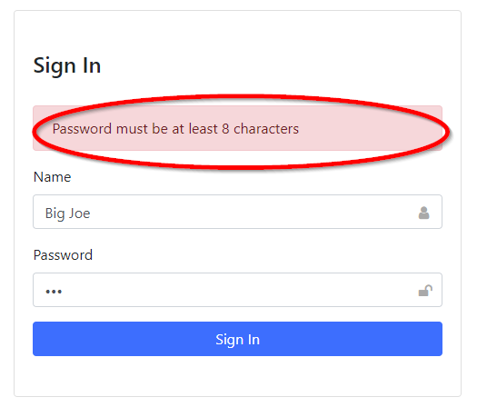
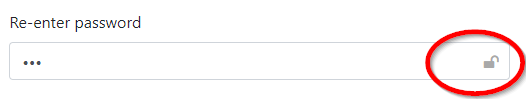

## Dash Holoniq Components

A set of house-keeping components for [Dash][dash-homepage] that make the
implementation of forms and larger, multi-page applications a
little easier.

    pip install dash-holoniq-components

### Components

The following components are available:

**Alert** The Alert component is hidden if it has no children. When children are injected the Alert
component sets its style to become visible

<p align="center"></p>


**ButtonLink** Allows you to create a clickable link within a multi-page app in
the same way as `dcc.Link`. The standard `dcc.Button` attributes `n_clicks` and `n_clicks_timestamp` have been
added to ButtonLink. These attributes can be used for notification that the `ButtonLink` has
been clicked. `ButtonLink` can be enabled/disabled allowing conditional control of the link via a Dash callback

**Form** The `Form` components normal submit action can be inhibited. The form data, as it would be
reported by the a submit action, is available in a Dash callback via the components `form_data` attribute.

```
app.layout = dhc.Form(formFields(), id="form", preventDefault=True),

@app.callback([...], [Input("form", "form_data")])
def _callback(form_data):
  pass
```

**InputWithIcon** Adds a font awesome glyph and tooltip to the end of a standard input box

<p align="center"></p>

```
import dash_holoniq_components as dhc

app.layout = html.Div
    dhc.InputWithIcon(...)
])

```

**LayoutRouter** The children of `LayoutRouter` are each wrapped in a Div that is
is hidden/shown based on the current value of the LayoutRouter 'switch' attribute.

The advantage of `LayoutRouter` over the standard dynamic content is that **ALL** the applications
layout is present in the DOM, but hidden, when the Dash application is first loaded. This means
that Dash callbacks can reference component ids without reference errors being reported.

Switching between pages using `LayoutRouter` needs minimal server communication resulting in
the fastest possible page updates.

```
import dash_holoniq_components as dhc

app.layout = html.Div([
      dhc.Location(id='loc'),
      dhc.LayoutRouter(children, routes=routes, id='router')
    ]

@app.callback([Output('router', 'switch')], [Input('loc', 'pathname')])
def _router_callback(pathname):
    route = 'default'

    if pathname:
        pathname = pathname[1:]
        if pathname in page_layouts:
            route = pathname

    return route
```

**PageTitle** Sets the page title:

<p align="center"></p>

```
from dash import html
import dash_holoniq_components as dhc

app.layout = html.Div([
    dhc.PageTitle(title='My Site', id='title')
])

```

**PasswordWithShow** Password input with a show/hide icon that can be clicked to reveal the password

<p align="center"></p>

**Location**

A modified version of *dash-core-components* Location component. Allows multiple instances
to co-exist. In the *dash-core-components* version the last instance is the only one
to get history event notifications.

**Button**

A modified version of *dash-core-components* Button component. The component
has a boolean *focus* attribute that is set true when the button gains
focus and false when it looses it. The focus attribute can be used in a dash
callback to hide an associated dropdown whenever the user clicks
the application background or makes a selection from the dropdown.

*Example dropdown callback*
```
    @callback(Output(ids.container(MATCH), 'className'),
            Input(ids.button(MATCH), 'n_clicks'),
            Input(ids.button(MATCH), 'focus'),
            State(ids.container(MATCH), 'className'))
    def show_dropdown(button_clicks, button_focus, className):
        logging.info('show_dropdown: button_clicks=%s, className = %s', button_clicks, className)

        if not button_clicks:
            return className

        if 'show' in className and button_focus == False:
            return className.replace(' show', '')
        else:
            return className + ' show'
```
### Usage Demo

The demo is a simple sign-in form and user profile that makes use of all the components.

To sign in enter a name and password. The password will be checked to see if it's at least
eight characters. If it is the user is redirected to the profile page.

To run the Python demo

        python usage.py

        python usage.py --port 8060

Then open [http://localhost:8050](http://localhost:8050)

### Examples

**examples/multi_page** This is a clone of the [Structuring a Multi-Page App] with
some added functionality.

    python -m examples.multi_page.index

**examples/form** A minimal SPA application with *home page*, *login form* and *profile page*.
Demonstrates the use of the following dash-holoniq-components: *PageTitle*, *Location*,
*LayoutRouter*, *Alert*, *InputWithIcon*, *PasswordWithShow*, *Form*

    python -m examples.form.index

**examples/checkbox_form** A form containing various checkbox examples.

    python -m examples.form.checkbox_form

### Building Component Library

For VSCODE developers a development container definition is
available in *.devcontainer*.

#### Install tools manually

These steps are only needed if you intend to build the project directly
on your computer. To build the project you must have python
and node installed on your computer. Then:

Create a virtual environment

```
python3 -m venv .venv
source  .venv/bin/activate

python -m pip install --upgrade pip
pip install -r requirements.txt
```
#### Build the project

Build the project:

    npm run build

Create tarball, first change the release version in package.json, then:

    python setup.py sdist bdist_wheel

The tarball is in *dist/dash_holoniq_components-<version>.tar.gz*

To install the tarball in a dash project:

    pip install dash_holoniq_components-<version>.tar.gz

#### Testing

Pytest and [Dash Duo](https://dash.plotly.com/testing) are used for testing. To run
these tests both the Chrome browser and Chrome driver must be installed. These are
allready installed in the VSCode Docker container. If you are note using remote containers
you must be install them first.

To run the tests:

    pytest

#### Publish

See [Create a production build and publish]

    twine upload dist/*

### Debugging the dash component JS source

To debug/single-step the JS component code in conjunction with a dash application:

In a terminal window start the dash application:

    python -m examples.form.index

Select debugger launch *1: JS Browser* and press F5. The chrome browser
will open and display your application. Enter breakpoints in your source
code eg *./src/lib/components/Location.react.js* as required.

### Debugging the python demo `usage.py`

In VSCODE select `2. Debug usage.py` from the launch options and press `F5` to launch the
Flask/Dash development server.

Open [http://localhost:8050](http://localhost:8050)

Set breakpoints as required.

[dash-homepage]: https://dash.plot.ly/
[Structuring a Multi-Page App]: https://dash.plotly.com/urls
[Create a production build and publish]: https://github.com/plotly/dash-component-boilerplate/blob/master/%7B%7Bcookiecutter.project_shortname%7D%7D/README.md#create-a-production-build-and-publish
